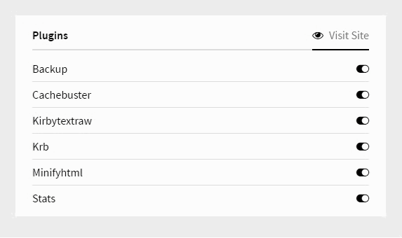

# Kirby - Plugins widget

#### Version 1.0.0 - 2016-08-03
- Initial Public Offering...

****

### What is it?

Kirby - Plugins widget, is a simple widget for the Kirby CMS.

It shows all plugins used in your site with the option to toggle their status (on / off).

More info about Kirby can be found at http://getkirby.com

##Installation##

- Download the .zip and place the ```plugins``` folder (located in ```site\widgets```) in your own ```widgets``` folder.
- Copy / paste the settings from ```site\config\config_example.php``` in your own ```config\config.php``` file **+)**.

**+)** **note** - at default these settings are correct.

If you need to change the default path of your plugins-folder, you can change the `plugins-widget` setting in this file.

****



*Version 1.0.0*